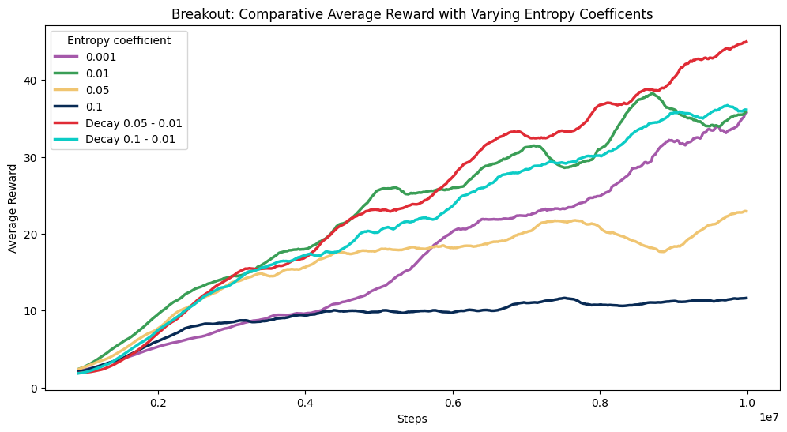

# Master's Dissertation: Investigating the Impact of Entropy Regularisation on an Attention Augmented Agent

## Overview
This repository contains the research conducted for my master's dissertation, which investigates the impact of entropy regularisation on reinforcement learning (RL) agents. The project aims to attempt to identify if there is the optimal entropy coefficients that maximize learning and stability in three different Atari environments: Space Invaders, Seaquest, and Breakout.

## Abstract
In reinforcement learning, the balance between exploration and exploitation is crucial for effective training. Entropy regularisation is a technique used to promote exploration and prevent the convergence to sub-optimal policies by introducing stochasticity in policy distributions. This research focuses on how varying entropy regularisation coefficients affect the learning outcomes and stability of an RL agent augmented with an attention module. Through experimentation with various entropy coefficients and decay strategies, it was found that decaying entropy typically offers better performance than static entropy settings. Additionally, the complexity added by the attention network was evaluated to determine its impact on the agent’s learning capabilities. The findings indicate a correlation between increased network complexity and the degradation of learning efficiency.

## Key Experiments
- **Entropy Coefficients**: Various coefficients were tested to determine which configurations yield the best results in terms of learning performance and stability.
- **Decay Strategies**: Both static and dynamic entropy configurations were explored, with particular focus on understanding their impact across different game environments.
- **Attention Mechanism**: The attention-augmented agent's decision-making processes were visualised using attention maps and provides insight into the influence of entropy regularisation on attention patterns.

## Results and Conclusions

### Breakout Comparative Average Reward with Varying Entropy Coefficents

## Video Demonstration
A video demonstration of the visualized attention maps and the agent's performance across different settings and environments can be viewed [here](https://www.youtube.com/watch?v=hS4bjPz-kGw).

## Keywords
`Reinforcement Learning`, `Entropy Regularisation`, `Exploration-Exploitation Balance`, `Attention`, `Attention Maps`, `Hyperparameter Tuning`

## Citation
If you find this research useful or refer to it in your academic or professional work, please consider citing it.

Maguire, D. (2024). Master's Dissertation: Investigating the Impact of Entropy Regularisation on an Attention Augmented Agent. [Source code]. https://github.com/maguid28/MSc-AttentionAugmentedRL

